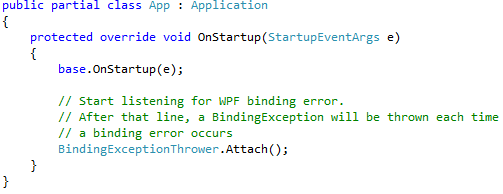

Turn WPF binding errors into exceptions
=

This project demonstrates how you can easily convert WPF binding errors into exception.
    

All it requires is a single line in your existing code.
    

Content
-

 1. [Project `WpfBindingError`](WpfBindingError) is a reusable assembly that listens for binding errors.
 2. [Project `SampleWpfApplication`](SampleWpfApplication) shows how to throw `BindingException` at runtime
 3. [Project `SampleWpfApplicationTests`](SampleWpfApplicationTests) shows how to check binding errors in a **unit test project**.
 
 Each project contains its own README, please check.