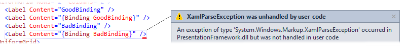

Turn WPF binding errors into exceptions
=

This project demonstrate out you can easily convert WPF binding errors into exception.
    

Integrating this in your project is as easy as:
    

Content
-

 1. `WpfBindingError` contains the actual code that throws `BindingException`.
 2. `SampleWpfApplication` shows a `BindingException` at runtime
 3. `SampleWpfApplicationTest` shows how you can check the binding errors in a unit test project.