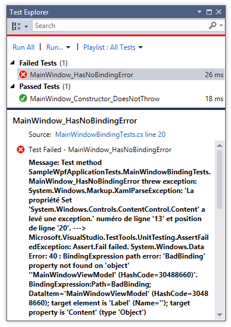

Unit testing WPF bindings
=

This project demonstrate how to test WPF binding errors in MSTest.

In this project, I use `BindingErrorListener`, a class that raises an event each time a WPF binding error occurs.

    [TestMethod]
    public void MainWindow_HasNoBindingError()
    {
        using( var listener = new BindingErrorListener())
        {
            listener.ErrorCatched += msg => Assert.Fail(msg);

            new MainWindow();
        }            
    }
    
As shown in the screen-shot, the test fails as expected because there is a bad binding in `MainWindow.xaml`.

By examining carefully the exception message, we can find the exact binding causing the error:

    BindingExpression path error: 'BadBinding' property not found on 'object' ''MainWindowViewModel' (HashCode=30488660)'.
    
    BindingExpression:Path=BadBinding; 
    DataItem='MainWindowViewModel' (HashCode=30488660);
    target element is 'Label' (Name='');
    target property is 'Content' (type 'Object')