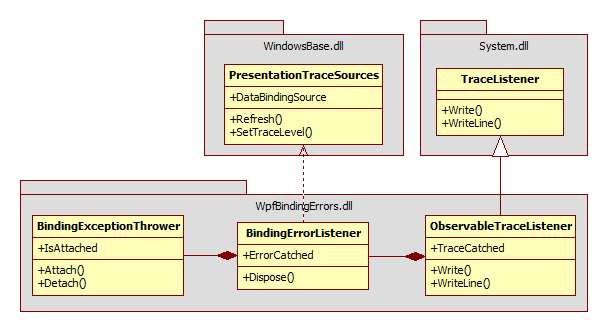

Turn WPF binding errors into exceptions
=

This project is a reusable assembly that converts WPF binding errors into exceptions.

Feel free to include it in your own project.
    
Content
-

 1. Class `BindingException` is the typed exception thrown when a binding error occurs
 2. Static class `BindingExceptionThrower` is the one that throws `BindingException`.
 3. Class `BindingErrorListener` adds a listener to `PresentationTraceSources.DataBindingSource`. It raises the event `ErrorCatched` whenever a binding error occurs.
 4. Class `ObservableTraceListener` is internal, it's an override of `System.Diagnostics.TraceListener` and it raises the event `TraceCatched` whenever a trace is written.
     
See an example in project `SampleWpfApplicationTests` in this repository.
   
Class diagram
-

 How to use it ?
-

The simplest it to use `BindingExceptionThrower` because it handles everything for you:

    BindingExceptionThrower.Attach()
    
That's all.  
Once you called `Attach()`, every WPF binding error will raise a `BindingException`.
See an example in project `SampleWpfApplication` in this repository.

However, if you want to be aware of binding errors without throwing an exception, you can use `BindingErrorListener`  and attach to `ErrorCatched` event.

    using( var listener = new BindingErrorListener())
    {
        listener.ErrorCatched += msg => Console.WriteLine("Binding error: {0}", msg);

        // ...do what you want here...
    }